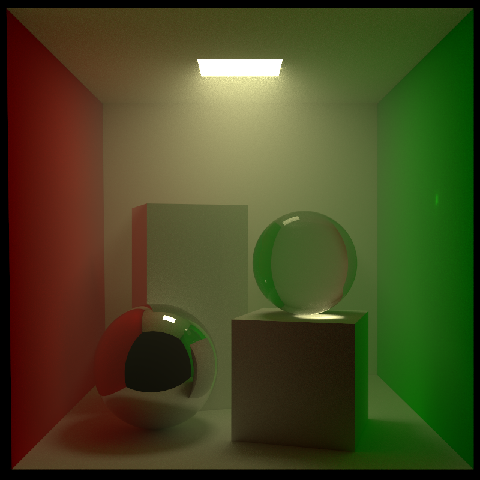
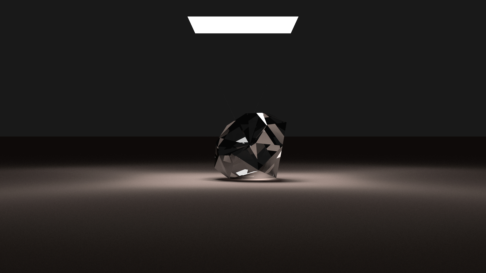
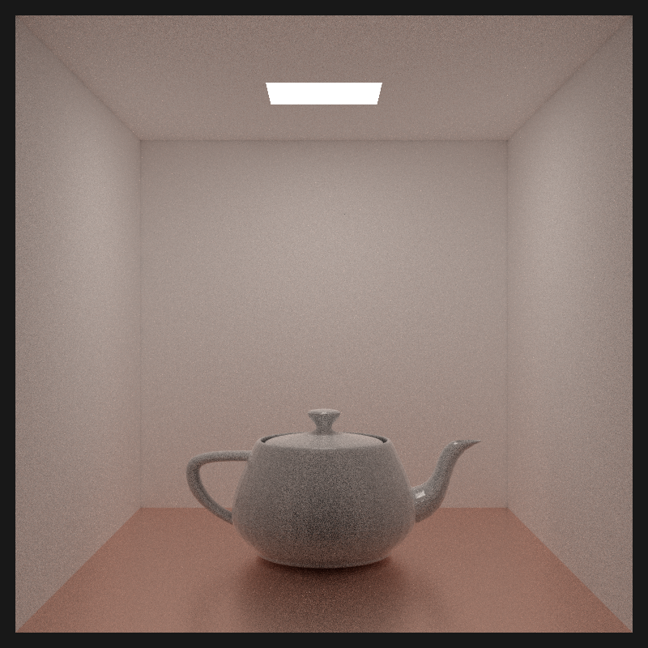

# Fractured-Ray

## Overview

Fractured-Ray is a raytracer implemented in Rust.

This project is currently under active development.

## Features

- Path tracing: global illumination, soft shadows, etc.
- Shape primitives: triangles, polygons, spheres, meshes, etc.
- Material primitives: diffuse, specular, refractive, scattering, etc.
- Transformation: rotation & translation
- Parallel rendering

## Examples

Cornell Box

Diamond

Teapot

## TODOs

- [x] Algorithms
  - [x] Path Tracing
  - [x] Distribution Ray Tracing
  - [x] Ray-Object Intersection Acceleration Structure
  - [x] BSDF & Cosine-Weighted Sampling
  - [x] Light Sampling
  - [x] Multiple Importance Sampling
  - [x] Stochastic Progressive Photon Mapping
- [ ] Shapes
  - [x] Primitives
    - [x] Planes
    - [x] Polygons
    - [x] Spheres
    - [x] Triangles
  - [x] Meshes
  - [x] Instance & Transformation
  - [ ] Shading Normal
  - [x] Entity Scene
- [ ] Volumes
  - [x] Volume Scene
  - [x] Single Scattering
  - [x] Multiple Scattering
- [x] Materials
  - [x] Primitives
    - [x] Blurry
    - [x] Diffuse
    - [x] Emissive
    - [x] Glossy
    - [x] Mixed
    - [x] Refractive
    - [x] Scattering
    - [x] Specular
- [x] Medium
  - [x] Primitive
    - [x] Isotropic
    - [x] Henyey-Greenstein
    - [x] Vaccum
- [ ] Textures
  - [x] Primitives
    - [x] Constant
    - [x] Checkerboard
    - [x] Image
    - [x] Noise
    - [x] Normal Visualization
    - [x] UV Visualization
  - [ ] Noise Generation
    - [x] Perlin Noise
    - [x] Fractal Brownian Motion
    - [ ] Domain Wrapping
  - [ ] UV Mapping
    - [ ] Planar
    - [ ] Spherical
    - [ ] Cylindrical
    - [x] UV Unwrapping
- [ ] Infrastructure
  - [x] Progress Bar
  - [ ] CLI
  - [ ] Description DSL
  - [x] External Model Import

## License

Copyright (C) 2025 Justin Chen

This project is licensed under the MIT License.
