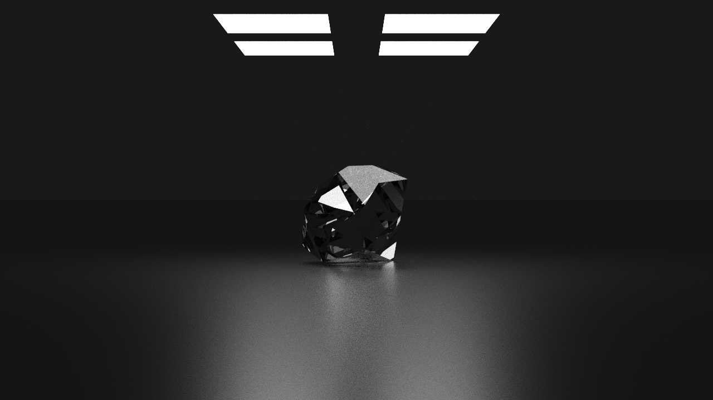

# Fractured-Ray

## Overview

Fractured-Ray is a raytracer implemented in Rust.

This project is currently under active development.

## Features

- Path tracing: global illumination, soft shadows, etc.
- Shape primitives: triangles, polygons, spheres, meshes, etc.
- Material primitives: diffuse, specular, refractive, scattering, etc.
- Transformation: rotation & translation
- Parallel rendering

## Examples

Cornell Box

Diamond

## TODOs

- [x] Algorithms
  - [x] Recursive rendering
  - [x] Fast ray-object intersection solving
  - [ ] Importance sampling
  - [ ] Light sampling
  - [ ] Physics-based illumination
- [ ] Shapes
  - [x] Common shape primitives
    - [x] Planes
    - [x] Polygons
    - [x] Spheres
    - [x] Triangles
  - [x] Meshes
  - [x] Instance & transformation
  - [ ] Volumes
  - [ ] Texture coordinate
  - [ ] Normal interpolation
- [ ] Materials
  - [ ] Common material primitives
    - [x] Diffuse
    - [x] Emissive
    - [ ] Glossy
    - [ ] Mixed
    - [x] Refractive
    - [x] Scattering
    - [x] Specular
- [ ] Textures
  - [ ] Migration for solid colors
  - [ ] Checker board
  - [ ] Simplex noise
- [ ] Infrastructure
  - [x] Progress bar
  - [ ] CLI options
  - [ ] Description DSL
  - [ ] External model import

# License

Copyright (C) 2025 Justin Chen

This project is licensed under the MIT License.
